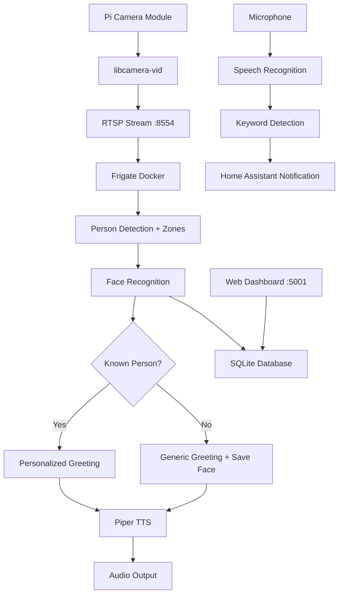

# 🔔 AI Smart Doorbell for Raspberry Pi 4

> Replace your Ring doorbell with a privacy-focused, locally-hosted AI system featuring face recognition, natural voice interaction, and a beautiful web dashboard.

[](https://opensource.org/licenses/MIT)
[](https://www.python.org/downloads/)
[](https://www.raspberrypi.com/)
[](https://www.home-assistant.io/)

## ✨ Features

### 🎯 Core Capabilities

| Feature | Description |
|---------|-------------|
| 👤 **Face Recognition** | Automatically identify family members, friends, and regular visitors |
| 🗣️ **Natural Voice** | Greet visitors with natural-sounding text-to-speech (Piper TTS) |
| 🎤 **Speech Recognition** | Listen and respond to visitor requests (Faster-Whisper) |
| 📱 **Mobile Notifications** | Instant alerts with snapshots via Home Assistant |
| 🌐 **Web Dashboard** | Modern UI for managing faces, settings, and visit history |
| 💾 **SQLite Database** | Track all visitors and maintain face recognition database |
| 📹 **AI Person Detection** | Frigate NVR with zone-based detection |
| 🔒 **Privacy-First** | All data stays on your local network |

### 🎨 Example Interactions

**Unknown Visitor:**
```
🔔 Doorbell detects person at 2-3 feet
🗣️ "Hello! How can I help you today?"
🎤 "Is anyone home?"
🗣️ "Let me check if anyone is available. One moment please."
📱 Notification sent to homeowners
```

**Recognized Person:**
```
🔔 Doorbell detects John approaching
👤 Face recognition identifies: John Smith
🗣️ "Hello John Smith! How can I help you today?"
📱 "John Smith is at the door"
```

## 🏗️ System Architecture



## 📋 Hardware Requirements

### Required
- **Raspberry Pi 4** (4GB RAM minimum, 8GB recommended)
- **Pi Camera Module** (v2 or v3)
- **USB Microphone** (any USB mic)
- **Speaker** (3.5mm jack or USB)
- **microSD Card** (32GB+ Class 10)
- **Power Supply** (Official Pi 4 adapter, 15W)

### Optional
- **Google Coral USB Accelerator** ($60) - Makes detection 10x faster
- **Weatherproof enclosure** - For outdoor installation
- **PoE HAT** - For cleaner power delivery

### Tested Configurations

| Config | Person Detection | Face Recognition | Total Response |
|--------|------------------|------------------|----------------|
| Pi 4 (4GB) + CPU | ~5 FPS | ~2s | ~8s |
| Pi 4 (8GB) + CPU | ~5 FPS | ~2s | ~8s |
| Pi 4 + Coral USB | ~15 FPS | ~2s | ~4s |

## 🚀 Installation

### Prerequisites

```bash
# Update your Pi
sudo apt update && sudo apt upgrade -y

# Ensure 64-bit OS (recommended)
uname -m  # Should output: aarch64
```

### Quick Install

```bash
# Download installer
curl -O https://raw.githubusercontent.com/YOUR_USERNAME/smart-doorbell/main/install.sh

# Make executable
chmod +x install.sh

# Run installer (takes ~30 minutes)
./install.sh
```

### What Gets Installed

- ✅ Docker + Docker Compose
- ✅ Home Assistant (container)
- ✅ Frigate NVR (container)
- ✅ Python environment (via uv)
- ✅ Face recognition libraries (dlib)
- ✅ Piper TTS with natural voice
- ✅ Faster-Whisper for speech recognition
- ✅ Flask web server
- ✅ SQLite database
- ✅ Systemd services

## 🎛️ Configuration

### 1. Home Assistant Setup

After installation, configure Home Assistant:

```bash
# Open Home Assistant
http://YOUR_PI_IP:8123

# Complete initial setup
# Create account
# Create long-lived access token:
#   Profile → Long-Lived Access Tokens → Create Token
```

Edit `~/doorbell/doorbell.py`:
```python
HA_TOKEN = "eyJhbGciOiJIUzI1NiIsInR5cCI6IkpXVCJ9..."  # Your token here
```

### 2. Calibrate Detection Zone

Open Frigate at `http://YOUR_PI_IP:5000` and watch the camera view. Note where people appear at 2-3 feet distance.

Edit `~/frigate/config/config.yml`:
```yaml
zones:
  close_range:
    coordinates: 400,100,880,100,880,860,400,860  # Adjust these coordinates
```

Restart Frigate:
```bash
cd ~/frigate && docker-compose restart
```

### 3. Add Known Faces

**Via Web Dashboard (Recommended):**
1. Open `http://YOUR_PI_IP:5001`
2. Click "Add Person"
3. Upload clear, frontal face photo
4. Enter name
5. Click "Add Person"

**Via CLI:**
```bash
cd ~/doorbell
uv run python manage_faces.py add photo.jpg "John Doe"
```

### 4. Start Services

```bash
# Enable services to start on boot
sudo systemctl enable doorbell-camera doorbell-web smart-doorbell

# Start services now
sudo systemctl start doorbell-camera doorbell-web smart-doorbell

# Check status
sudo systemctl status smart-doorbell
```

## 🌐 Web Dashboard Guide

Access at `http://YOUR_PI_IP:5001`

### Dashboard Tabs

#### 📊 Dashboard (Home)
- Real-time statistics
- Total known persons
- Total visits
- Unknown faces count

#### 👥 Known Persons
- Grid view of all recognized people
- Add new persons with photos
- Edit/delete existing persons
- Mark as "Family" or "Trusted"
- See last seen timestamp

#### ❓ Unknown Faces
- Gallery of unrecognized visitors
- Click to identify and add name
- Automatically becomes known person
- Sorted by most recent

#### 📋 Recent Visits
- Complete visitor history
- Shows recognized vs unknown
- Displays spoken text
- Includes timestamps and snapshots

#### ⚙️ Settings
Live configuration (no restart needed):

| Setting | Default | Range | Description |
|---------|---------|-------|-------------|
| Cooldown Seconds | 45 | 10-300 | Time between greetings |
| Face Tolerance | 0.6 | 0.4-0.7 | Recognition strictness |
| Min Person Confidence | 0.75 | 0.5-0.95 | Detection threshold |
| Greeting Message | "Hello! How can I help you today?" | - | Default greeting |
| Recognized Greeting | "Hello {name}! ..." | - | Use {name} placeholder |
| Listen Timeout | 8 | 3-15 | Seconds to listen |
| Enable Face Recognition | true | true/false | Toggle recognition |

## 📱 Home Assistant Integration

### Mobile App Setup

1. Install [Home Assistant Companion App](https://companion.home-assistant.io/)
2. Connect to your Home Assistant instance
3. Doorbell automatically sends notifications

### Notification Format

```
Title: 🔔 Front Door Visitor
Message: John Smith is at the door. They said: "Is anyone home?"
Image: [Snapshot of visitor]
Actions: [View Camera] [Open Door]
```

### Automation Examples

```yaml
# automation.yaml

# Flash lights when doorbell rings
- alias: "Doorbell - Flash Lights"
  trigger:
    - platform: state
      entity_id: binary_sensor.front_door_person
      to: "on"
  action:
    - service: light.turn_on
      target:
        entity_id: light.living_room
      data:
        flash: short

# Announce visitor on speakers
- alias: "Doorbell - TTS Announcement"
  trigger:
    - platform: mqtt
      topic: doorbell/visitor
  action:
    - service: tts.google_translate_say
      target:
        entity_id: media_player.kitchen
      data:
        message: "{{ trigger.payload_json.person_name }} is at the front door"
```

## 🛠️ CLI Commands

### Face Management

```bash
cd ~/doorbell

# List all known faces
uv run python manage_faces.py list

# Add face from photo
uv run python manage_faces.py add "/path/to/photo.jpg" "First Last"

# View unknown faces
uv run python manage_faces.py unknown

# Identify unknown face
uv run python manage_faces.py add "faces_db/unknown/unknown_1234567.jpg" "Jane Doe"

# Remove person
uv run python manage_faces.py remove "First Last"
```

### System Management

```bash
# View logs
sudo journalctl -u smart-doorbell -f        # Main doorbell
sudo journalctl -u doorbell-web -f          # Web interface
sudo journalctl -u doorbell-camera -f       # Camera stream
docker logs -f frigate                      # Frigate
docker logs -f homeassistant               # Home Assistant

# Restart services
sudo systemctl restart smart-doorbell
cd ~/frigate && docker-compose restart

# Check system status
~/test_doorbell.sh

# Database access
sqlite3 ~/doorbell/doorbell.db
> SELECT * FROM persons;
> SELECT * FROM visits ORDER BY timestamp DESC LIMIT 10;
```

## 🔧 Advanced Configuration

### Custom Voice Models

Download voices from [Piper Voices](https://huggingface.co/rhasspy/piper-voices):

```bash
cd ~/piper

# Male voice
wget https://huggingface.co/rhasspy/piper-voices/resolve/main/en/en_US/joe/medium/en_US-joe-medium.onnx
wget https://huggingface.co/rhasspy/piper-voices/resolve/main/en/en_US/joe/medium/en_US-joe-medium.onnx.json

# British accent
wget https://huggingface.co/rhasspy/piper-voices/resolve/main/en/en_GB/alba/medium/en_GB-alba-medium.onnx
wget https://huggingface.co/rhasspy/piper-voices/resolve/main/en/en_GB/alba/medium/en_GB-alba-medium.onnx.json

# Update in web dashboard settings or doorbell.py
```

### Performance Tuning

**Reduce CPU usage:**
```yaml
# ~/frigate/config/config.yml
cameras:
  front_door:
    detect:
      fps: 3           # Lower from 5
      width: 640       # Lower from 1280
      height: 480      # Lower from 960
```

**Optimize face recognition:**
```python
# In web dashboard settings
face_tolerance = 0.7  # More lenient (fewer false negatives)
face_tolerance = 0.4  # More strict (fewer false positives)
```

## 🐛 Troubleshooting

### Camera Issues

```bash
# Check camera detection
vcgencmd get_camera
# Should output: supported=1 detected=1

# Test camera manually
libcamera-hello -t 5000

# Check camera service
sudo systemctl status doorbell-camera
sudo journalctl -u doorbell-camera -f

# Restart camera service
sudo systemctl restart doorbell-camera
```

### Face Recognition Not Working

```bash
# Test face recognition library
cd ~/doorbell
uv run python -c "import face_recognition; print('OK')"

# Check face database
uv run python manage_faces.py list

# Adjust tolerance in web dashboard (Settings tab)
# Try values between 0.4 (strict) and 0.7 (lenient)
```

### Audio Problems

```bash
# List audio devices
aplay -l              # Output devices
arecord -l            # Input devices

# Test speaker
speaker-test -t wav -c 2

# Test microphone
arecord -d 3 test.wav && aplay test.wav

# Adjust volume
alsamixer
```

### Web Dashboard Not Loading

```bash
# Check web service
sudo systemctl status doorbell-web
sudo journalctl -u doorbell-web -f

# Test locally
curl http://localhost:5001

# Check firewall
sudo ufw status
sudo ufw allow 5001/tcp
```

### Frigate Not Detecting

```bash
# Check Frigate logs
docker logs frigate

# Open Frigate UI
http://YOUR_PI_IP:5000

# Verify camera stream
ffprobe rtsp://localhost:8554/cam

# Reduce detection threshold
# Edit ~/frigate/config/config.yml
# Change threshold from 0.75 to 0.6
```

## 📊 Database Schema

### Tables

**persons**
```sql
id              INTEGER PRIMARY KEY
name            VARCHAR(100) UNIQUE
photo_path      VARCHAR(255)
face_encoding_path VARCHAR(255)
notes           TEXT
is_family       BOOLEAN
is_trusted      BOOLEAN
created_at      DATETIME
last_seen       DATETIME
```

**visits**
```sql
id              INTEGER PRIMARY KEY
person_name     VARCHAR(100)
is_recognized   BOOLEAN
snapshot_path   VARCHAR(255)
timestamp       DATETIME
spoken_text     TEXT
response_text   TEXT
confidence      FLOAT
```

**settings**
```sql
id              INTEGER PRIMARY KEY
key             VARCHAR(100) UNIQUE
value           VARCHAR(500)
description     TEXT
updated_at      DATETIME
```

### Queries

```sql
-- Most frequent visitors
SELECT person_name, COUNT(*) as visits 
FROM visits 
WHERE is_recognized = 1 
GROUP BY person_name 
ORDER BY visits DESC 
LIMIT 10;

-- Unknown visitors by date
SELECT DATE(timestamp) as date, COUNT(*) as unknown_visitors
FROM visits
WHERE is_recognized = 0
GROUP BY DATE(timestamp)
ORDER BY date DESC;

-- Recent family visits
SELECT v.timestamp, v.person_name, v.spoken_text
FROM visits v
JOIN persons p ON v.person_name = p.name
WHERE p.is_family = 1
ORDER BY v.timestamp DESC
LIMIT 20;
```

## 🔐 Privacy & Security

### Data Storage
- **All data stored locally** on your Raspberry Pi
- **No cloud services** required or used
- **Face encodings** stored as mathematical representations, not photos
- **Visit history** kept in local SQLite database

### Security Recommendations

```bash
# Set up firewall
sudo apt install ufw
sudo ufw enable
sudo ufw allow 22/tcp      # SSH
sudo ufw allow 5001/tcp    # Web dashboard
sudo ufw allow 8123/tcp    # Home Assistant

# Change default passwords
# Set strong password for web dashboard (add authentication)
# Use SSH keys instead of passwords

# Regular security updates
sudo apt update && sudo apt upgrade -y

# Monitor logs for suspicious activity
sudo journalctl -u smart-doorbell --since "1 hour ago"
```

### Data Retention

```bash
# Auto-delete unknown faces older than 30 days
echo "0 2 * * * find ~/doorbell/faces_db/unknown/ -name '*.jpg' -mtime +30 -delete" | crontab -

# Backup and encrypt face database
tar -czf - ~/doorbell/faces_db/ | gpg -c > faces-backup-$(date +%Y%m%d).tar.gz.gpg
```

### GDPR Compliance

If subject to GDPR:
1. **Inform visitors** - Add signage about face recognition
2. **Provide access** - Allow individuals to request their data
3. **Enable deletion** - Implement process to remove person's data
4. **Document processing** - Maintain records of face data usage
5. **Limit retention** - Auto-delete old visit records

## 🔄 Backup & Restore

### Full Backup

```bash
# Create backup
cd ~
tar -czf doorbell-backup-$(date +%Y%m%d).tar.gz \
    doorbell/ \
    frigate/config/ \
    homeassistant/

# With encryption
tar -czf - doorbell/ frigate/config/ homeassistant/ | \
    gpg -c > doorbell-backup-$(date +%Y%m%d).tar.gz.gpg
```

### Restore

```bash
# Extract backup
tar -xzf doorbell-backup-YYYYMMDD.tar.gz

# Or decrypt first
gpg -d doorbell-backup-YYYYMMDD.tar.gz.gpg | tar -xz

# Restart services
sudo systemctl restart smart-doorbell doorbell-camera doorbell-web
cd ~/frigate && docker-compose restart
docker restart homeassistant
```

### Automated Backups

```bash
# Create backup script
cat > ~/backup-doorbell.sh << 'EOF'
#!/bin/bash
BACKUP_DIR=~/backups
mkdir -p $BACKUP_DIR
tar -czf $BACKUP_DIR/doorbell-$(date +%Y%m%d-%H%M).tar.gz \
    ~/doorbell/doorbell.db \
    ~/doorbell/faces_db/
# Keep only last 7 days
find $BACKUP_DIR -name "doorbell-*.tar.gz" -mtime +7 -delete
EOF

chmod +x ~/backup-doorbell.sh

# Add to crontab (daily at 2 AM)
echo "0 2 * * * ~/backup-doorbell.sh" | crontab -
```

## 📈 Monitoring & Stats

### System Resources

```bash
# CPU and memory usage
htop

# Temperature
vcgencmd measure_temp

# Check for throttling
vcgencmd get_throttled

# Disk usage
df -h
du -sh ~/doorbell ~/frigate
```

### Performance Metrics

```bash
# Frigate stats
curl http://localhost:5000/api/stats | jq

# Database stats
sqlite3 ~/doorbell/doorbell.db << EOF
SELECT 'Total Persons:', COUNT(*) FROM persons;
SELECT 'Total Visits:', COUNT(*) FROM visits;
SELECT 'Recognition Rate:', 
  ROUND(100.0 * SUM(CASE WHEN is_recognized THEN 1 ELSE 0 END) / COUNT(*), 2) || '%'
FROM visits;
EOF

# Service uptime
systemctl status smart-doorbell | grep Active
```

## 🛣️ Roadmap

### Version 2.0 (Planned)
- [ ] Multi-camera support
- [ ] Mobile app (React Native)
- [ ] Two-way audio communication
- [ ] Facial expression detection
- [ ] Age/gender estimation
- [ ] Cloud backup option (encrypted)

### Version 2.5 (Future)
- [ ] License plate recognition
- [ ] Package detection
- [ ] Pet detection
- [ ] Integration with smart locks
- [ ] Voice commands to doorbell
- [ ] Multi-language support

### Community Requests
- [ ] Alexa/Google Home integration
- [ ] MQTT support
- [ ] Custom notification sounds
- [ ] Email notifications
- [ ] Webhook support
- [ ] REST API

## 🤝 Contributing

We welcome contributions! Here's how:

### Getting Started

1. Fork the repository
2. Create a feature branch
   ```bash
   git checkout -b feature/amazing-feature
   ```
3. Make your changes
4. Test thoroughly on Pi 4
5. Commit with clear messages
   ```bash
   git commit -m "Add: Amazing new feature"
   ```
6. Push to your fork
   ```bash
   git push origin feature/amazing-feature
   ```
7. Open a Pull Request

### Development Setup

```bash
# Clone your fork
git clone https://github.com/YOUR_USERNAME/smart-doorbell.git
cd smart-doorbell

# Create development environment
uv venv
source .venv/bin/activate
uv pip install -e ".[dev]"

# Run tests
pytest

# Format code
black .
isort .
```

### Code Style

- Follow PEP 8
- Use type hints
- Add docstrings
- Write tests for new features
- Update documentation

## 📝 License

This project is licensed under the MIT License - see [LICENSE](LICENSE) for details.

### Third-Party Licenses

This project uses:
- **Frigate** - MIT License
- **Piper TTS** - MIT License
- **Faster-Whisper** - MIT License
- **face_recognition** - MIT License
- **Home Assistant** - Apache 2.0 License
- **Flask** - BSD-3-Clause License

## 🙏 Acknowledgments

### Core Technologies
- [Frigate](https://github.com/blakeblackshear/frigate) by Blake Blackshear
- [Piper](https://github.com/rhasspy/piper) by Rhasspy
- [Faster-Whisper](https://github.com/guillaumekln/faster-whisper) by Guillaume Klein
- [face_recognition](https://github.com/ageitgey/face_recognition) by Adam Geitgey
- [Home Assistant](https://www.home-assistant.io/) by Home Assistant Team
- [uv](https://github.com/astral-sh/uv) by Astral

### Inspiration
- Ring Video Doorbell (for showing what's possible)
- Open source community for privacy-focused alternatives

## 💬 Support

### Get Help

- 📖 **Documentation**: [Wiki](https://github.com/YOUR_USERNAME/smart-doorbell/wiki)
- 💬 **Discussions**: [GitHub Discussions](https://github.com/YOUR_USERNAME/smart-doorbell/discussions)
- 🐛 **Bug Reports**: [GitHub Issues](https://github.com/YOUR_USERNAME/smart-doorbell/issues)
- 💡 **Feature Requests**: [GitHub Issues](https://github.com/YOUR_USERNAME/smart-doorbell/issues)

### Community

- [Discord Server](https://discord.gg/YOUR_INVITE) - Chat with other users
- [Reddit](https://reddit.com/r/smart_doorbell) - Share your builds
- [YouTube](https://youtube.com/@YOUR_CHANNEL) - Video tutorials

## 📊 Project Stats


---

<div align="center">

**Made with ❤️ for privacy-focused home automation**

**If this project helped you, please ⭐ star the repository!**

[Report Bug](https://github.com/YOUR_USERNAME/smart-doorbell/issues) · 
[Request Feature](https://github.com/YOUR_USERNAME/smart-doorbell/issues) · 
[Documentation](https://github.com/YOUR_USERNAME/smart-doorbell/wiki)

</div>
